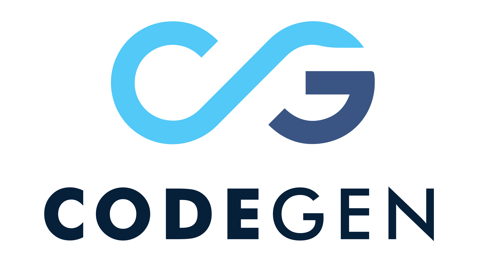
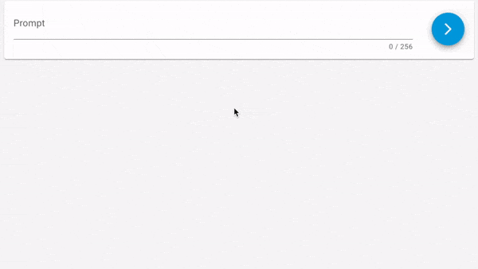

<p align="center">
  
</p>

# CodeGen
Official release for the **CodeGen1** and **CodeGen2** models (`350M`, `1B`, `3B`, `7B` `16B`) for **Program Synthesis** by [Salesforce AI Research](https://www.salesforceairesearch.com/).

<p align="center">
  
</p>

## News

**July 2023**

[**CodeGen2.5**](https://github.com/salesforce/CodeGen/tree/main/codegen25) released outperforming 16B parameter models with only 7B.

**May 2023**

**CodeGen2.0** released with strong infill sampling capability.

**March 2022**

**CodeGen1.0** released on par with OpenAI Codex at the time.

## Publications

[CodeGen: An Open Large Language Model for Code with Multi-Turn Program Synthesis](https://arxiv.org/abs/2203.13474)  
[Erik Nijkamp](https://enijkamp.github.io/)\*, [Bo Pang](https://scholar.google.com/citations?user=s9fNEVEAAAAJ&hl=en)\*, [Hiroaki Hayashi](https://hiroakih.me/)\*, [Lifu Tu](https://home.ttic.edu/~lifu/), [Huan Wang](https://scholar.google.com/citations?user=7NpTttkAAAAJ&hl=en), [Yingbo Zhou](https://scholar.google.com/citations?user=H_6RQ7oAAAAJ&hl=en), [Silvio Savarese](https://scholar.google.com/citations?user=ImpbxLsAAAAJ&hl=en), and [Caiming Xiong](https://scholar.google.com/citations?user=vaSdahkAAAAJ&hl=en)   
ICLR, 2023

[CodeGen2: Lessons for Training LLMs on Programming and Natural Languages](https://arxiv.org/abs/2305.02309)   
[Erik Nijkamp](https://enijkamp.github.io/)\*, [Hiroaki Hayashi](https://hiroakih.me/)\*, [Caiming Xiong](https://scholar.google.com/citations?user=vaSdahkAAAAJ&hl=en), [Silvio Savarese](https://scholar.google.com/citations?user=ImpbxLsAAAAJ&hl=en), and [Yingbo Zhou](https://scholar.google.com/citations?user=H_6RQ7oAAAAJ&hl=en)  
ICLR, 2023

## Usage

The models are available on the [Hugging Face Hub](https://huggingface.co/models?search=salesforce+codegen).

**CodeGen1.0**

```python
import torch
from transformers import AutoTokenizer, AutoModelForCausalLM

tokenizer = AutoTokenizer.from_pretrained("Salesforce/codegen-2B-mono")
model = AutoModelForCausalLM.from_pretrained("Salesforce/codegen-2B-mono")
inputs = tokenizer("# this function prints hello world", return_tensors="pt")
sample = model.generate(**inputs, max_length=128)
print(tokenizer.decode(sample[0], truncate_before_pattern=[r"\n\n^#", "^'''", "\n\n\n"]))
```

**CodeGen2.0**

```python
import torch
from transformers import AutoTokenizer, AutoModelForCausalLM

tokenizer = AutoTokenizer.from_pretrained("Salesforce/codegen2-7B")
model = AutoModelForCausalLM.from_pretrained("Salesforce/codegen2-7B", trust_remote_code=True, revision="main")
inputs = tokenizer("# this function prints hello world", return_tensors="pt")
sample = model.generate(**inputs, max_length=128)
print(tokenizer.decode(sample[0], truncate_before_pattern=[r"\n\n^#", "^'''", "\n\n\n"]))
```

**CodeGen2.5**

```python
import torch
from transformers import AutoTokenizer, AutoModelForCausalLM

tokenizer = AutoTokenizer.from_pretrained("Salesforce/codegen25-7b-mono", trust_remote_code=True)
model = AutoModelForCausalLM.from_pretrained("Salesforce/codegen25-7b-mono")
inputs = tokenizer("# this function prints hello world", return_tensors="pt")
sample = model.generate(**inputs, max_length=128)
print(tokenizer.decode(sample[0]))
```

## Training

The Jaxformer library for data pre-processing, training and fine-tuning the CodeGen models can be found here:

https://github.com/salesforce/jaxformer

## Citation
If you find our code or paper useful, please cite the paper:
```bibtex
@article{nijkamp2022codegen,
  title={CodeGen: An Open Large Language Model for Code with Multi-Turn Program Synthesis},
  author={Nijkamp, Erik and Pang, Bo and Hayashi, Hiroaki and Tu, Lifu and Wang, Huan and Zhou, Yingbo and Savarese, Silvio and Xiong, Caiming},
  journal={ICLR},
  year={2023}
}

@article{nijkamp2023codegen2,
  title={CodeGen2: Lessons for Training LLMs on Programming and Natural Languages},
  author={Nijkamp, Erik and Hayashi, Hiroaki and Xiong, Caiming and Savarese, Silvio and Zhou, Yingbo},
  journal={ICLR},
  year={2023}
}
```
